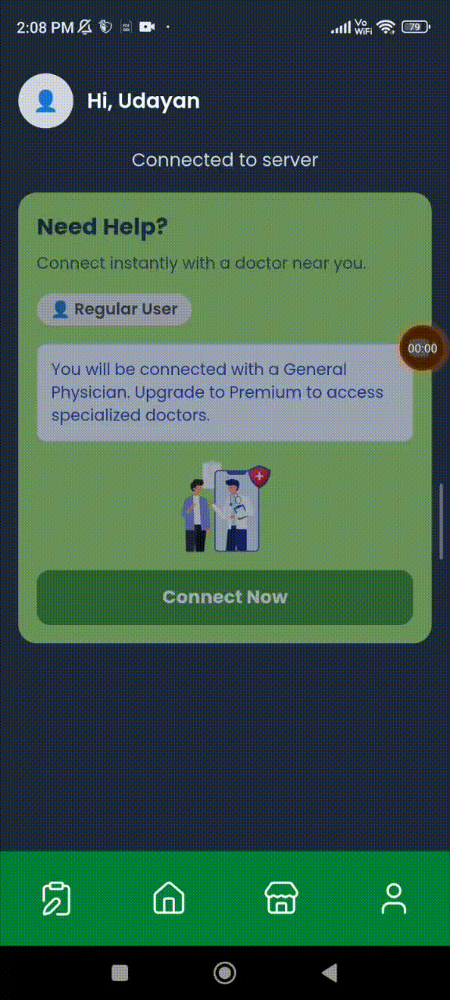

# Medi Mitra — Your Healthcare Companion (Web + Android)

Welcome to Medi Mitra. This guide explains, in simple steps, how to use the app and website. No technical knowledge needed.

Use Medi Mitra to:
- Find nearby pharmacies and check live medicine stock on a map
- Talk to doctors via secure video calls
- Check symptoms with AI (with voice input)
- Upload prescriptions for fast fulfilment
- Manage profiles (patients, doctors, pharmacies)
- Use the pharmacy panel for inventory (add, update, delete stock)
- Choose your language for a comfortable experience

## Who is Medi Mitra for?
- **Patients:** Search pharmacies, check medicine availability, get AI symptom help, talk to doctors, upload prescriptions.
- **Doctors:** Manage profile, receive patient calls, conduct video consultations.
- **Pharmacies:** Show live stock, appear on the map, manage inventory.

---

## Quick Start

### Option A — Web (Desktop/Mobile)
1) Open the website in your browser (Chrome recommended).  
   Tip: Add to Home Screen for a native-like experience.  
2) Create an account or log in.  
3) Choose your role: Patient, Doctor, or Pharmacy.

<p align="center">
  
</p>

### Option B — Android App
1) Download the APK from the provided link (the app is not on app stores).  
2) Allow installs from your browser or file manager:  
   `Settings > Security > Install unknown apps > [your app] > Allow from this source`  
3) Open the APK file and tap Install.  
4) Open the app, create an account or log in, then choose your role.

---

## Change Language (Multilingual)
Choose your language on the login screen.
1) On the login page, tap one of the three language buttons.  
2) The app/website will render in that language after you log in.  
3) To change language later, log out, choose another language on the login page, and log in again.

<p align="center">
  
</p>

---

## 🩺 Role-based Login

Choose your role during sign-in:

- **Patient:** Access health services, search pharmacies, use the AI symptom checker, join video calls, and view prescriptions.  
- **Doctor:** Conduct video consultations, manage your patient queue.  
- **Pharmacy:** Manage inventory, update live stock, and make your store visible on the map.  

🔄 You can **switch roles anytime** by logging out and signing back in with the desired role.

### 🧪 Demo Credentials

Use the following **test credentials** to explore each role:

| Role       | Email                        | Password   |
|------------|------------------------------|------------|
| 👤 Patient  | `user1@gmail.com`           | `12345678` |
| 🩺 Doctor   | `doctor1@gmail.com`         | `12345678` |
| 💊 Pharmacy | `pharmacy1@gmail.com`       | `12345678` |

<p align="center">
  
</p>

---

## Patient Profile
Keep your health info handy for faster care.

**First-time login:**
1) Right after creating or logging into a new account, you'll be asked to fill your patient details once (name, contact, health info as available).  
2) Save when done.

**Switch or add profiles later:**
1) Open the Profile tab.  
2) Tap "Switch Profiles".  
3) You'll be redirected to the Choose Profile screen.  
4) Select an existing profile, or tap Add New Profile to create another one. Adding a new profile follows the same steps as first-time login.

You can edit any profile anytime.

<p align="center">
  
</p>

---

## AI Symptom Checker (with Voice)
Get guidance on symptoms before you visit a doctor.
1) Open Symptom Checker.  
2) Speak or type your symptoms. Allow microphone access when asked.  
3) Review suggestions (not a diagnosis).  
4) If needed, proceed to consult a doctor.

**Tips:**
- Be clear and speak in a quiet place.  
- Use your preferred language when available.

<p align="center">
  
</p>

---

## Upload Prescription
Share your prescription with pharmacies for quick fulfilment.
1) Go to Prescriptions or Upload Prescription.  
2) Take a photo or select a file.  
3) Check that the image is clear and readable.  
4) Submit. You'll be notified when a pharmacy updates status.

**Note:** Only upload prescriptions from licensed medical professionals.

<p align="center">
  
</p>

---

## Video Call with a Doctor
Speak with a doctor from home.
1) From the Patient area, request a consultation.  
2) Allow camera and microphone permissions.  
3) When the doctor joins, your call begins.  

**Good to know:**
- A stable internet connection improves video quality.

<p align="center">
  
</p>

---

## Find Pharmacies, Live Stock, and Map
See nearby pharmacies and check medicine availability in real time.
1) Open Pharmacy Finder / Map.  
2) Allow location access for better results.  
3) Search for a medicine or browse pharmacies.  
4) View live stock indicators and directions on the map.

<p align="center">
  
</p>

---

## Doctor Panel
Designed for doctors to manage consultations.
1) Complete your Doctor Profile (specialization, experience, timings).  
2) Set availability so patients know when you're online.  
3) Start the video call.  
4) End calls and update notes where available.

<p align="center">
  
</p>

---

## Pharmacy Panel
Tools for pharmacies to manage store presence and stock.
1) Complete your Pharmacy Profile.  
2) Update live stock so patients see accurate availability.  
3) Keep your map location accurate for easy navigation.

<p align="center">
  
</p>

---

## Inventory Management (Add, Update, Delete Stock)
Pharmacies can manage inventory in a few taps.
1) Open Inventory in the Pharmacy panel.  
2) Add new items (name, brand, dosage, quantity).  
3) Update quantities as stock changes.  
4) Delete discontinued items.

<p align="center">
  
</p>

---

## Project Structure

```
medi-mitra/
├── assets/                    # Demo GIFs and media files
├── backend/                   # Backend server code
├── client/                    # Frontend application
├── .gitignore
└── README.md                  # This file
```

---

## Technical Stack

- **Frontend:** React.js (Capacitor)
- **Backend:** Node.js / Express / Dockerized
- **Database:** AWS RDS PostgreSQL
- **Video Calling:** WebRTC
- **AI/ML:** Symptom analysis integration
- **Maps:** Google Maps API / Mapbox

---

## Installation & Setup

### Prerequisites
- Node.js (v14 or higher)
- npm or yarn
- AWS RDS PostgreSQL

### Backend Setup
```bash
cd backend
npm install
npm start
```

### Client Setup
```bash
cd client
npm install
npm start
```

### Android APK Build
```bash
cd client
npm run build:android
```

---

## License

This project is licensed under the MIT License - see the LICENSE file for details.

---

## Support

For support, email support@medimitra.com or open an issue in the repository.

---

## Acknowledgments

- Thanks to all healthcare workers who inspired this project
- Special thanks to our beta testers and contributors

---

Made with ❤️ by the Medi Mitra Team